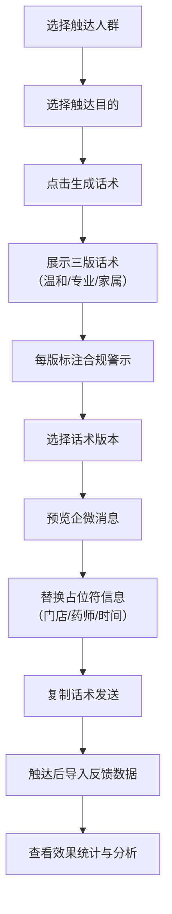

## 1. 产品概述

面向药店私域运营团队的企微话术生成工具，围绕医保个账会员权益提供合规、克制的会员触达方案。解决运营人员话术不规范、容易违规承诺医保报销或返钱的痛点，让私域沟通更准确、更像药店专业服务。

- **核心价值**：通过结构化话术模板降低合规风险，提升会员触达转化率
- **目标用户**：药店私域运营人员、店长、药师
- **产品定位**：智能辅助工具，核心是合规与专业，而非营销自动化

## 2. 核心功能

### 2.1 用户角色

| 角色 | 使用场景 | 核心需求 |
|------|----------|----------|
| 运营人员 | 日常会员触达 | 快速生成合规话术、批量发送预览 |
| 店长 | 效果复盘 | 查看话术转化率、优化触达策略 |
| 药师 | 专业内容审核 | 确保医学术语准确、服务预约信息正确 |

### 2.2 功能模块

1. **话术生成页**：人群选择、触达目的选择、三版话术生成、合规提示
2. **消息预览页**：企微消息预览、占位符替换、发送前确认
3. **反馈归类页**：结果导入、数据统计、效果分析

### 2.3 页面详情

| 页面名称 | 模块名称 | 功能描述 |
|-----------|-------------|---------------------|
| 话术生成页 | 人群选择卡片 | 高血压复购会员、个账支付会员、家庭账户绑定咨询会员，单选 |
| 话术生成页 | 触达目的选择 | 权益到期提醒、药师服务预约、健康品类复购、政策解释，单选 |
| 话术生成页 | 话术生成区域 | 温和提醒版、药师专业版、家属协助版三栏并列展示 |
| 话术生成页 | 合规提示栏 | 每版话术标注"不应承诺"内容，红色醒目标识 |
| 话术生成页 | 生成按钮 | 根据选择动态生成对应话术 |
| 消息预览页 | 企微消息模拟器 | 模拟会员收到的短消息样式，包含头像、消息气泡 |
| 消息预览页 | 占位符编辑 | 门店地址、药师姓名、可咨询时间，支持手动输入替换 |
| 消息预览页 | 话术切换 | 在三版话术之间切换预览 |
| 消息预览页 | 复制导出 | 一键复制话术文本 |
| 反馈归类页 | 数据导入 | 支持Excel/CSV导入店员回填的触达结果 |
| 反馈归类页 | 效果统计 | 咨询量、到店量、核销量的卡片展示与图表 |
| 反馈归类页 | 话术效果排行 | 按转化率对比不同话术版本效果 |
| 反馈归类页 | 时间筛选 | 按触达日期范围筛选统计数据 |

## 3. 核心流程

运营人员选择触达人群和目的，系统生成三版合规话术，每版标注禁止承诺内容。运营人员预览消息效果，替换门店和药师信息后复制发送。触达完成后，导入店员反馈数据，查看各话术版本的转化效果。

## 4. 用户界面设计

### 4.1 设计风格

- **主色调**：深青色（#1A5F7A）- 代表专业、信任、医疗健康
- **辅助色**：暖橙色（#FF8C42）- 代表关怀、温和、服务
- **警示色**：珊瑚红（#E74C3C）- 用于合规警示内容
- **中性色**：米白背景（#FAF8F5）、深灰文字（#2C3E50）
- **按钮风格**：圆润边角（12px）、微阴影、悬停上浮效果
- **字体**：标题使用"Noto Serif SC"（宋体）体现专业稳重，正文使用"Noto Sans SC"（黑体）保证可读性
- **布局风格**：卡片式布局，充足留白，医疗健康行业的克制与专业感
- **图标风格**：线性图标，粗细适中，圆角端点，避免过于科技感

### 4.2 页面设计概览

| 页面名称 | 模块名称 | UI元素 |
|-----------|-------------|-------------|
| 话术生成页 | 选择区域 | 卡片式选项，选中态有青绿色边框，淡入动画 |
| 话术生成页 | 话术卡片 | 三栏等宽布局，每版话术有独立色调（温和版-浅绿、专业版-深蓝、家属版-暖橙） |
| 话术生成页 | 合规警示 | 红色边框卡片，带警告图标，不可点击 |
| 消息预览页 | 手机模拟器 | 圆角手机框，企微聊天界面，消息气泡从左滑入 |
| 消息预览页 | 编辑面板 | 表单式布局，输入框有聚焦动画 |
| 反馈归类页 | 统计卡片 | 数据大字展示，带增长趋势小箭头 |
| 反馈归类页 | 图表区域 | 简洁柱状图，对比三版话术效果 |

### 4.3 响应式设计

- **桌面优先**：1440px基准设计，三栏话术并列展示
- **平板适配**：1024px切换为两栏布局，第三版换行
- **移动端**：768px以下单栏堆叠，选择区域改为底部抽屉
- **触控优化**：按钮最小44px高度，输入框充足内边距

### 4.4 动效设计

- **页面加载**：顶部进度条 + 内容区块渐入（staggered animation）
- **话术生成**：骨架屏加载 → 三版话术从左到右依次淡入
- **选择交互**：选中卡片轻微放大（scale: 1.02），阴影加深
- **合规提示**：警示框有呼吸效果，引起注意但不闪烁
- **消息预览**：话术切换时气泡有打字机效果
