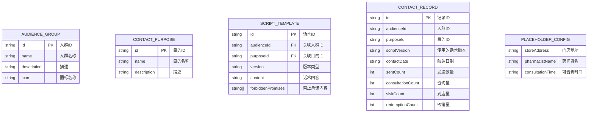

## 1. 架构设计

纯前端单页应用，使用React 18 + TypeScript构建，数据全部使用Mock数据，无需后端服务。

```mermaid
flowchart LR
    A["React 18 + TypeScript] --> B["Vite 构建工具]
    B --> C["TailwindCSS 样式]
    A --> D["React Router 路由]
    A --> E["Recharts 图表]
    A --> F["Lucide React 图标]
    G["Mock 数据层"] --> A
    H["本地存储 LocalStorage] --> G
```

## 2. 技术描述

- **前端框架**：React 18 + TypeScript
- **构建工具**：Vite 5
- **样式方案**：TailwindCSS 3.4
- **路由管理**：React Router DOM 6
- **图表库**：Recharts 2
- **图标库**：Lucide React
- **状态管理**：React Hooks (useState, useContext)
- **数据持久化**：LocalStorage
- **后端**：无，使用Mock数据

## 3. 路由定义

| 路由 | 页面 | 用途 |
|-------|------|------|
| / | 话术生成页 | 选择人群和目的，生成三版话术 |
| /preview | 消息预览页 | 预览企微消息，替换占位符 |
| /feedback | 反馈归类页 | 导入数据，查看效果统计 |

## 4. 数据模型

### 4.1 数据结构定义



### 4.2 TypeScript 类型定义

```typescript
// 人群类型
type AudienceGroup = {
  id: 'hypertension' | 'personal-account' | 'family-binding';
  name: string;
  description: string;
  icon: string;
};

// 触达目的类型
type ContactPurpose = {
  id: 'expiry-reminder' | 'pharmacist-appointment' | 'repurchase' | 'policy-explain';
  name: string;
  description: string;
};

// 话术版本
type ScriptVersion = 'gentle' | 'professional' | 'family';

// 话术模板
type ScriptTemplate = {
  id: string;
  audienceId: AudienceGroup['id'];
  purposeId: ContactPurpose['id'];
  version: ScriptVersion;
  versionName: string;
  content: string;
  forbiddenPromises: string[];
};

// 触达记录
type ContactRecord = {
  id: string;
  audienceId: AudienceGroup['id'];
  purposeId: ContactPurpose['id'];
  scriptVersion: ScriptVersion;
  contactDate: string;
  sentCount: number;
  consultationCount: number;
  visitCount: number;
  redemptionCount: number;
};

// 占位符配置
type PlaceholderConfig = {
  storeAddress: string;
  pharmacistName: string;
  consultationTime: string;
};
```

### 4.3 Mock 数据结构

```typescript
// 预设人群数据
const audienceGroups: AudienceGroup[] = [
  {
    id: 'hypertension',
    name: '高血压复购会员',
    description: '近3个月购买过降压药的会员',
    icon: 'heart-pulse'
  },
  {
    id: 'personal-account',
    name: '个账支付会员',
    description: '近期使用过医保个人账户支付的会员',
    icon: 'credit-card'
  },
  {
    id: 'family-binding',
    name: '家庭账户咨询会员',
    description: '咨询过家庭账户绑定的会员',
    icon: 'users'
  }
];

// 预设触达目的
const contactPurposes: ContactPurpose[] = [
  {
    id: 'expiry-reminder',
    name: '权益到期提醒',
    description: '提醒会员个账权益即将到期'
  },
  {
    id: 'pharmacist-appointment',
    name: '药师服务预约',
    description: '邀请会员预约药师咨询服务'
  },
  {
    id: 'repurchase',
    name: '健康品类复购',
    description: '提醒会员补充常用药品'
  },
  {
    id: 'policy-explain',
    name: '政策解释',
    description: '解读医保个人账户政策'
  }
];
```

## 5. 核心组件结构

```
src/
├── components/
│   ├── layout/
│   │   └── AppLayout.tsx      # 应用布局，侧边栏布局
│   │   └── Sidebar.tsx          # 导航
│   ├── generator/
│   │   ├── AudienceSelector.tsx # 人群选择组件
│   │   ├── PurposeSelector.tsx # 目的选择组件
│   │   ├── ScriptCard.tsx        # 话术卡片组件
│   │   └── ComplianceAlert.tsx   # 合规提示组件
│   ├── preview/
│   │   ├── WechatSimulator.tsx   # 企微消息模拟器
│   │   └── PlaceholderEditor.tsx # 占位符编辑器
│   └── feedback/
│       ├── DataImport.tsx        # 数据导入组件
│       ├── StatsCard.tsx         # 统计卡片
│       ├── EffectChart.tsx       # 效果图表
│       └── ScriptRanking.tsx     # 话术效果排行
├── data/
│   ├── mockData.ts               # Mock数据
│   └── scriptTemplates.ts        # 话术模板数据
├── hooks/
│   └── useScriptGenerator.ts     # 话术生成Hook
├── types/
│   └── index.ts                  # 类型定义
├── pages/
│   ├── GeneratorPage.tsx         # 话术生成页
│   ├── PreviewPage.tsx           # 消息预览页
│   └── FeedbackPage.tsx          # 反馈归类页
├── App.tsx
├── main.tsx
└── index.css
```
